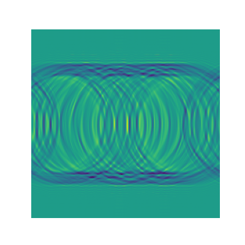

# Inverse-Wave-Equation

## Research Methodology:
In this work, I propose an image-generative model by reversing the wave equation. 
I am investigating this because the previous works(mentioned in the references) show a very clear trend that physics-based equations have a promising generative modeling counterpart.

First, a general solution to the wave equation is of the following form:

where exp is the exponential function, A is any complex number, and ω, kx, and ky are three numbers such that ω = f(kx,ky). The number ω is called the angular frequency of the wave, and the vector k = (kx,ky) its wave vector. This relation between the angular frequency and wave vector is called the dispersion relation. It can be used to infer some important properties of the waves like the speed at which the information and energy it carries propagate.
Additionally, if we add -iγ|k| to the angular frequency, it functions as a dissipative component, which works by removing energy from the wave thereby decaying it.

The idea is to use this equation to propagate any image forward in time which will lead it to a prior distribution. Then the neural network can reverse the flow, essentially exhibiting a generative process by reversing any randomly drawn image from the said prior.

## Results
Forward Process

-------------------------------------------------------------
Reverse Process

## Challenges:
As is evident from the simulation attached above, the images propagate towards a non-trivial prior distribution.
One reason is that I have not used any dissipative components in the wave propagation. If used, it will remove high frequency components and would result in a better prior as the image evolves. That remains to be tested.

## References: 
1. Inverse Heat Equation (https://arxiv.org/pdf/2206.13397.pdf)
2. Simulating wave propagation with the optical Fourier engine (https://medium.com/optalysys/simulating-wave-propagation-with-the-optical-fourier-engine-f4a9f2e74d28)
3. GENPHYS: From Physical Processes to Generative Models (https://arxiv.org/pdf/2304.02637.pdf)
