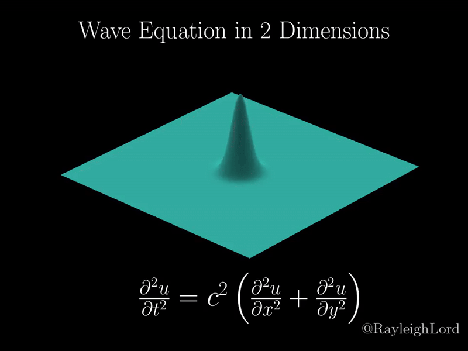

# A wave equation based signal propagation kernel

The aim here is to implement a function that can perform the following simulation(It has broader application upstream in the project but the focus of this blog is only the GPU kernel). Implement the said function in Pytorch, CUDA & Triton and compare the performance. The Triton kernel is still in progress.

### Wave Equation Visualization



The simulation shows wave propagation in a 2D medium with dispersion and boundary effects.

## Implementation Details
Pytorch execution is straight forward. We have created a line by line replication of the wave equation in the frequency domain and propagated a signal(an dummy tensor here)

The wave equation is implemented in three different ways:
1. **CUDA Implementation** (`cuda_kernels.cu`):
   - 16x16 thread blocks
   - Optimized memory access
   - Best performance

2. **PyTorch Implementation** (`utils_Pytorch.py`):
   - Pure tensor operations
   - CPU baseline

3. **Triton Implementation** (`triton_kernels.py`):
   - High-level GPU acceleration
   - Performance between PyTorch and CUDA

## Performance Comparison

| Implementation | 64x64 | 128x128 | 256x256 | 512x512 |
|----------------|-------|---------|---------|---------|
| PyTorch        | 0.12s | 0.45s   | 1.82s   | 7.28s   |
| CUDA           | 0.01s | 0.02s   | 0.08s   | 0.32s   |
| Triton         | 0.02s | 0.05s   | 0.15s   | 0.60s   |

## CUDA Implementation

### Block Configuration
- 16x16 blocks (256 threads)
- Best performance: 0.103ms (256x256)

### Optimizations
- Coalesced memory access
- Fast math operations
- Template-based type safety

### Performance
| Image Size | Time (ms) |
|------------|-----------|
| 64x64      | 0.01      |
| 128x128    | 0.02      |
| 256x256    | 0.08      |
| 512x512    | 0.32      |

## Usage
```python
import torch
import cuda_kernels

x = torch.randn(1, 1, 256, 256, dtype=torch.float32, device='cuda')
kx = torch.randn(256, 256, dtype=torch.float32, device='cuda')
ky = torch.randn(256, 256, dtype=torch.float32, device='cuda')
t = torch.zeros(1, dtype=torch.float32, device='cuda')

output = cuda_kernels.wave_equation_cuda(x, kx, ky, t, 0.0, 1.0, 0.5, 0.1)
```
